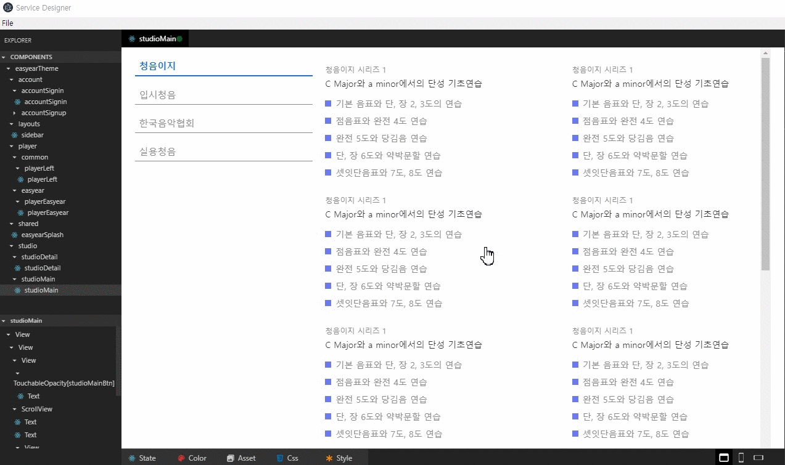

<!-- README -->
<!-- GIF file is just guid line, it will updated later with demo page-->

# ServiceDesigner
**_ServiceDesigner_** is an efficient editor for UI developing using React or React Native framework.
<!-- > ServiceDesginer is an Editor to update design of your project using react or react-native.  
> React & React-Native Design Editor desktop app built on top of Electron.  
> You can update both web and app design created by react or react-native.   -->

<!-- gif 파일 juice 페이지로 수정 필요 => 현재 청음이지 페이지로 보여주고 있으므로 -->
> just example GIF image yet  
  

## Introduction
> Let's think about the case when you developed an Android Application.  
> You had to run an emulator, wait until it get started, test how it works, fix some part of your code and reload it.  
> Maybe you are tired of doing necessary, but inefficient work process again and again.:dizzy:  
> With **_ServiceDesigner_**, you don't have to waste your time to check how component looks like at the screen.  
> Give it a try and let **_ServiceDesigner_** helps to make your work process more convenient.  
> And work with your UI _efficiently_, _speedily_, _visually_ and _simply_.  

### Base frameworks
- [React](https://reactjs.org/) : Web framework
- [React Native](https://facebook.github.io/react-native/) : Mobile Application framework

### Usable library & toolkit with frameworks
- [React Icons](http://react-icons.github.io/react-icons/)
- [Reactstrap](https://reactstrap.github.io/) : React Bootstrap 4 components
- [React Native Elements](https://react-native-training.github.io/react-native-elements/) : React Native UI Toolkit  


## Development
- Install ServiceDesigner
```
npm install
```
- Start ServiceDesigner
```
npm start 
```

<!-- ## build
```
npm run dist
``` -->


## Tutorial
:books:[Tutorial](https://github.com/hyun12345/ServiceDesigner/blob/tutorial/TUTORIAL.md)