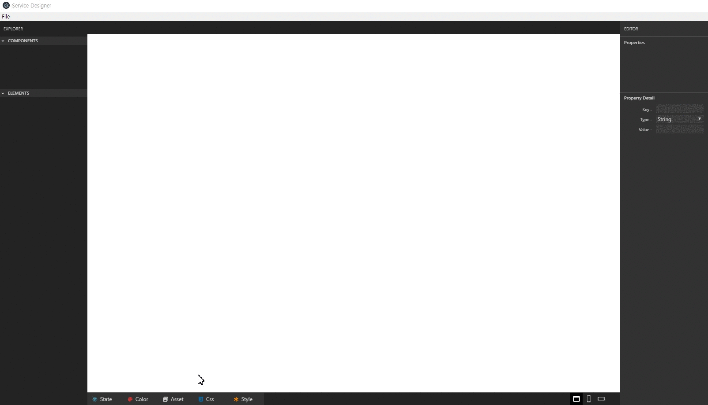

<!-- TUTORIAL -->
# ServiceDesigner Tutorial
## Contents
* [File](#file)  
    * [Save File](#save-file)
    * [Open File](#open-file)
* [Component](#component)  
* [Element](#element)  
* [Property](#property)  
* [Feature](#feature)
    * [State](#state)
    * [Color](#color)
    * [Asset](#asset)
    * [Css](#css)
    * [Style](#style)

## File  
**File** menu offer save or open file at **_ServiceDesigner_**.  
<!-- > When use **ServiceDesigner** at your project, you have to save and open '_design.save.json_'. -->
> You can check there are **three** type files : '_design.component.tsx_', '_design.save.json_', '_design.style_'.  
> * '_design.component.tsx_' be used when extend  each _web_ or _app_ component.  
> * '_design.save.json_' be used when using **_ServiceDesigner_**. You can open, update and save design file through this json file.  
> * '_design.style_' be used when set style or css of each component.  

### Save File
<!-- > If you haven't used **_ServiceDesigner_** before, you need to save file.   -->
<!-- > It's really simple to save file. Because there are no file to call and updat or fix. -->
>1. Whenever you're ready, click the '_file_' menu and '_save_'.  
>   (The short cut key is _ctrl_ + _s_.)  
>1. Then create '_design_' directory at '_src_', just in case separate design code file from other code files.  

  

### Open File
> If there is saved file, let's open it.  
>1. Click the '_file_' menu and '_open_'.
>   (The short cut key is _ctrl_ + _o_.)
>1. Select the '_design.save.json_' file and open it.


<!--    -->

## Component  
## Element  
## Property  
> The property supports following special scheme.
## Feature

### State  
> The scheme is json.  

### Color
> Support Color variables. The variables should be defined color tab.  
```
Color.XXX
```
```css
{  
    "backgroundColor": "Color.red"  
}
```

### Asset
> Support Asset variables. The variables should be defined asset tab.
```
Asset.XXX
```
### Css

### Style


<!-- - File : Open saved 'design.save.json' file to update your project at ServiceDesigner.
- State : The scheme is json.
- Style : The Style supports following special shceme.

  Color.XXX : Support Color variables. The variables should be defined color tab.
  Asset.XXX : Support Asset variables. The variables should be defined asset tab.
  ex ) { "backgroundColor": "Color.red" }

- Property : the property supports following special shceme.

  First checkbox is if the attribute is active.
  Second checkbox is if the attribute is binded with state variable.
  Asset.XXX : Asset tab scheme. -->