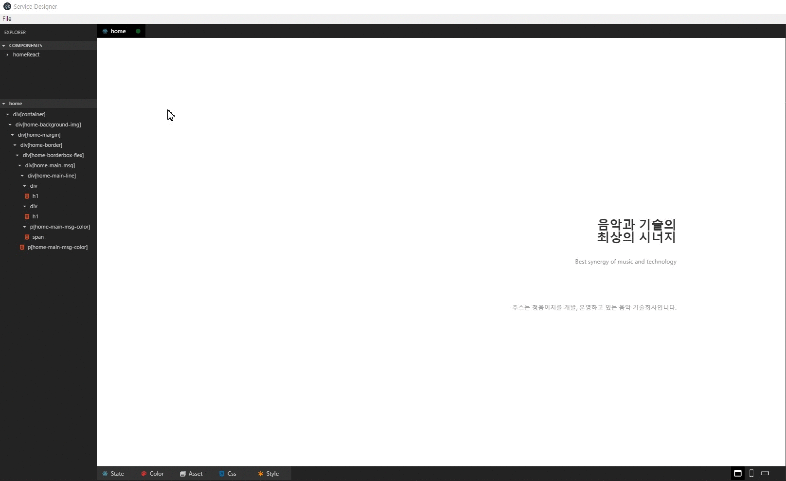

<!-- TUTORIAL -->
# ServiceDesigner Tutorial
## Contents
* [File](#file)  
    * [Save File](#save-file)
    * [Open File](#open-file)
    * [Other Features of File Menu](#other-features-of-file-menu)
* [Components](#components)  
    * [Create](#create)
    * [Rename](#rename)
    * [Delete](#delete)
    * [Other Features of Components Tab](#other-features-of-components-tab)
* [Element](#element)  
* [Property](#property)  
* [Feature](#feature)
    * [State](#state)
    * [Color](#color)
    * [Asset](#asset)
    * [Css](#css)
    * [Style](#style)  

## File  
**File** menu offers feature to save or open design file at **_ServiceDesigner_**, so user can update or test their UI.  
> You can check there are **three** type files : _design.component.tsx_, _design.save.json_, _design.style_.  
> * _design.component.tsx_ be used when extend it at the each _web_ or _app_ component and implement it.  
> * _design.save.json_ be used when using **_ServiceDesigner_**. You can open and save design file through this json file.  
> * _design.style_ be used when set style or css of each component.  

### Save File  
<!-- > If you haven't used **_ServiceDesigner_** before, you need to save file.   -->
<!-- > It's really simple to save file. Because there are no file to call and updat or fix. -->
1. Click the _file_ menu and _save_.  
    (The short cut key is _ctrl_ + _s_)  
1. Then create _design_ directory at _src_, just in case separate design code file from other code files.  

> Example of saving file  
  

### Open File  
<!-- > If there is saved file, let's open it.   -->
1. Click the _file_ menu and _open_.  
    (The short cut key is _ctrl_ + _o_)
1. Select the _design.save.json_ file and open it.

> Example of opening file (=> can be changed later / maybe to file which has more components or groups in design.save.json?) 
  


### Other Features of File Menu 
* _Save to another folder_  
> You can move newly updated design files to another folder through this feature.  
> (The short cut key is _ctrl_ + _shift_ + _s_)
* _reload_
> Reload **_ServiceDesigner_**.

## Components  
**Components** tab is for dealing with _group_ or _component_. 

> Example of using components function.  


### Create  
> * Right-click at the **Components** tab and click _New Group_ or _New Component_.  
> * If you don't input new _group_ or _component_'s name, they will not be created.  
> * So please remember to _input the group or component's name_.  

### Rename  
> * Just like _create_, right-click and click _rename_ where you want to do it.
> * If you don't input _group_ or _component_'s name newly, it's name will not be changed.  

### Delete  
> * At the first, right-click and click _delete_ wherever you want, like other features. 
> * Just in case, let's imagine the situation that you deleteed some group or component.
> * _However_ it was accident, not you really wanted it.
> * Don't be panic already! Please open your file again, before you save it.
> * Then you can check there will be a group or component which you deleted before reopening it.

### Other Features of Components Tab  
* _ShortCuts_  
  
> When you hover COMPONENTS tab, there will be some buttons will be on the tab.
> There are **three** main featueres in short cuts : _create group_, _create component_, _collapse groups_.

* _Unselect_  
> If there is a selected group or component, that one will be highlighted because of the sigh of activated.  
> So if you click _Unselected_, nothing will be selected in Components tab.  

* _Collapse groups in the Components Tab_
> Collapse all groups in the Components tab. 

## Element  
## Property  
> The property supports following special scheme.
## Feature

### State  
> The scheme is json.  

### Color
> Support Color variables. The variables should be defined color tab.  
```
Color.XXX
```
```css
{  
    "backgroundColor": "Color.red"  
}
```

### Asset
> Support Asset variables. The variables should be defined asset tab.
```
Asset.XXX
```
### Css

### Style


<!-- - File : Open saved 'design.save.json' file to update your project at ServiceDesigner.
- State : The scheme is json.
- Style : The Style supports following special shceme.

  Color.XXX : Support Color variables. The variables should be defined color tab.
  Asset.XXX : Support Asset variables. The variables should be defined asset tab.
  ex ) { "backgroundColor": "Color.red" }

- Property : the property supports following special shceme.

  First checkbox is if the attribute is active.
  Second checkbox is if the attribute is binded with state variable.
  Asset.XXX : Asset tab scheme. -->