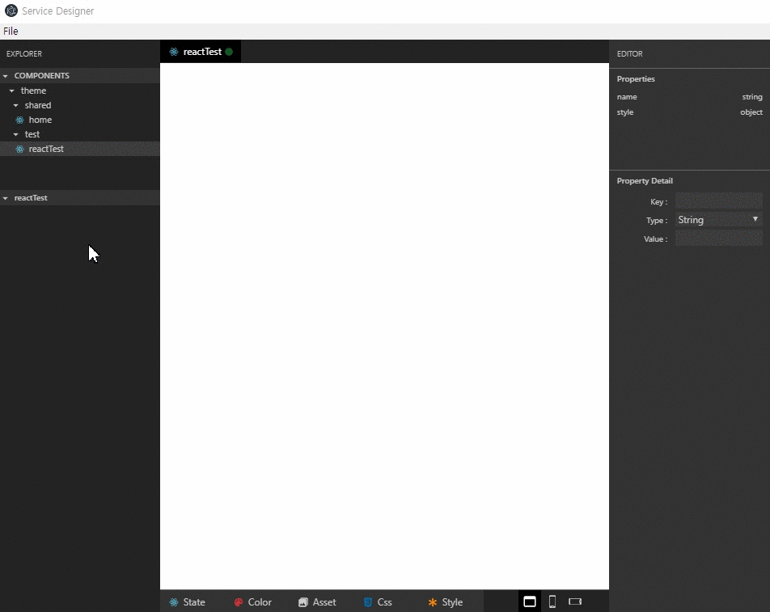
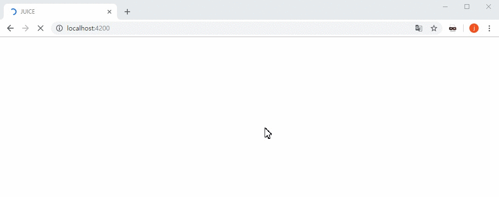

<!-- TUTORIAL -->
<!-- GIF file is just guid line, it will updated later with demo page -->

> The gif image file is temporary example, so maybe it looks messy.  
> It will be uploaded with demo page later.

# ServiceDesigner Tutorial
## Contents
* [Menu](#menu)
    * [File](#file)  
        * [Save File](#save-file)
        * [Open File](#open-file)
        * [Other Functions of File Menu](#other-functions-of-file-menu)
* [Explorer](#explorer)
    * [Components](#components)  
        * [New](#new)
        * [Rename](#rename)
        * [Delete](#delete)
        * [Other Functions of Components Tab](#other-functions-of-components-tab)
    * [Element](#element)  
        * [HTML](#html)  
        * [Reactstrap](#reactstrap)  
        * [React Icons](#react-icons)  
        * [React Native](#react-native)  
        * [RN Elements](#rn-elements)  
* [Editor](#editor)
    * [Properties](#properties)  
    * [Property Detail](#property-detail)
    * [Other Functions of Editor](#other-functions-of-editor)
* [Other Functions](#other-functions)
    * [State](#state)
    * [Color](#color)
    * [Asset](#asset)
    * [Css](#css)
    * [Style](#style)  
* [Inheritance](#inheritance)
    * [Render](#render)


# Menu
## File  
**File** menu is to save or open design file at **_ServiceDesigner_**, so user can work with their UI.  
> You can check there are **three** type files : _design.component.tsx_, _design.save.json_, _design.style.css_.  
> * _design.component.tsx_ is for extending design component at your project.  
>   * There are all components that you created at **_ServiceDesigner_**.  
>   * All of them have render() method including return array of elements.  
> * _design.save.json_ is for working with UI in **_ServiceDesigner_**.  
> * _design.style.css_ is for setting style property of your elements in **_ServiceDesigner_** freely as way you want.  

> Whenever you update some part of elements, properties or whatever at **_ServiceDesigner_**, the files will be updated automatically.  
> Except _design.style.css_. This file is static, so nothing will be changed.  

### Save File(_ctrl_ + _s_)  
>   
> 1. Click the _file_ menu and _Save file_.  
> 1. Then create _design_ directory at _src_, to separate design component from others just in case.
> 1. And save it.  
> 1. If you already created _design_ directory before, just save it.

### Open File(_ctrl_ + _o_)  
>   
> 1. Click the _file_ menu and _Open file_.  
> 1. Select the _design.save.json_ file and open it.

### Other Functions of File Menu 
#### 1. _Save to another folder_(_ctrl_ + _shift_ + _o_)    
> 1. Click the _file_ menu and _Save to another folder_.  
> 1. Select the folder and save it.  

#### 2. _reload_
> Reload **_ServiceDesigner_**.
  


# Explorer
## Components  
**Components** tab is for managing _group_ or _component_. 

### New  
>   
> * Right-click at the **Components** tab and click _New Group_ or _New Component_.  
>   * If you don't input new _group_ or _component_'s name, they will not be created.  
>   * So please remember to _input the group or component's name_.  
>   * Also, you can use short cut buttons to create group or component.

### Rename  
>   
> * Just like [NEW](#new), right-click and click _Rename_ at _group_ or _component_ that you want to change the name.  
> * If you don't input _group_ or _component_'s name newly, it's name will not be changed.  

### Delete  
>   
> * Right-click and click _Delete_ like other functions.  
>   * Just in case, let's imagine the situation that you deleted some group or component.  
>   * _However_ it was just an accident, not you really wanted.  
>   * Don't be panic already! Please open your file again, before you save it.  
>   * Then you can check there will be a group or component which you deleted before reopening it.  

### Other Functions of Components Tab  
#### 1. _ShortCuts_  
>   
> When you hover on the **Components** tab, there will be some buttons on the right side of the tab.  
> There are **three** main functions in these short cuts : _create group_, _create component_, _collapse groups_.  
> * _create group_ & _create component_ are same functions from [New](#new).  
> * _collapse groups_ literally collapses all groups in the **Components** tab.  

#### 2. _Unselect_  
> If there is a selected group or component, that one will be highlighted because it was activated.  
> So if you don't need to activate it anymore, just click _Unselect_.  
> As the result, nothing will be selected in **Components** tab.  

#### 3. _Collapse_
> * If you want to collapse some group, but not all groups, just the group.  
> * When uncollapse it, click it again.  


## Element  
**Element** tab is for working with UI design to render using _React_ or _React Native_ framework and several libraries.  

### HTML  
>   
> * Right-click and clcik _Add Html_, and put the name of what you want to add in your component.  
> * Use html tag just like in your coding editor.  
> * Please remember it, if you don't intput the name, it will not be added. Just like at the [Components](#components).

### Reactstrap  
> [ReactStrap](https://reactstrap.github.io/) provides bootstrap component for React framework.  
>   
> * You can use _Bootstrap 4 components_ in this function.  
> * You don't have to import each components whenever you use it!  
> * Just input the name of one of ReactStrap's components, and set property if you need.  
- [Reactstrap](https://reactstrap.github.io/) : React Bootstrap 4 components  

### React Icons  
> [React Icons](http://react-icons.github.io/react-icons/) provides free open srouce icons for React framework.  
>   
> * It has **eight** type of icon libraries that you can use easily.  
> * _Font Awesome_, _Ionicons_, _Material Design icons_, _Typicons_, _Github Octicons_, _Feather_, _Game Icons_, _Weather Icons_.  
> * Set element's name as the name of icon from the libraries what you want to use.  
> * Then set size, color and other properties at the Property tab if you want.
- [React Icons](http://react-icons.github.io/react-icons/)  

### React Native  
>   
> * Before using **React Native** element, set the screen as mobile by clicking one of the buttons from the bottom.  
> * You can set the screen _to Portrait_ or _to Landscape_ easily through these buttons.  
> * Just click the button that you want to work with UI.  
> * Then right-click and add element and input the name of compomnent what you need.  

### RN Elements  
> [React Native Elements](https://react-native-training.github.io/react-native-elements/) provides UI toolkit for React Native framework.
>   
> * If you want to work with UI without missing any details, set the screen as mobile, just like [React Native](#react-native).  
> * After that, right-click and add React Native element.  
> * Set the property if it is necessary.

### Delete  
> You can delete elements through this function.  
> If you input wrong name, just right-click, delete it and add new one!  

# Editor  
**Editor** tab is for managing properties.

## Properties
>   
> When you add an element at your component, **two** default properties added automatically : _name_, _style_.  
> * _name_  
>>  * You can check the name of element in **Elements** tab as you set.  
>>  * You will use _name_ to call the element when you extend design component to your project.  
> * _style_
>>  * You can set style of each element in this tab. Just fill out as object format.  
>>  * And also, you can set style per _if condition's result value_ : _true_ or _false_ in here.  
> As you can see, properties needed for setting UI not only at **_ServiceDesigner_** but also at your project.

>   
> ### 1. _Add Property_  
>> * Right-click and click _Add Property_.
>> * You have to fill out _Property Detail_, at least the _key_.  
>> * After filling out key and the other values, please click the _save button_.  
>> * If you don't click it, there won't be new property. So please remember clicking this button.  
>> * And be careful! If you add properties that element doesn't have, nothing will happen.  
>> * Just like, add text property and set the value in View element which doesn't have text property.  
> ### 2. _Delete Property_  
>> Right-click and click _Delete Property_.

## Property Detail
> There are **three** details to set the property : _Key_, _Type_, _Value_.  
> * _Key_ is for setting the keyName of property. 
>   * For example, _name_, _stlye_ are all the key values for the properties. 
>> If you don't set _Key_'s value, there will be added blank property, and it won't work properly.  
>> So at least, you have to set _Key_'s value when adding property.  
> * _Type_ has **six** detailed types : _String_, _Number_, _Boolean_, _Function_, _Object_, _Variable_.
>>  ### 1. _String_ or _Number_  
>>> _String_ or _Number_ can only have value which has string or number type.  
>>  ### 2. _Boolean_  
>>> * You can input it's value by checking or unchecking when the type is _Boolean_.  
>>>     * _Unchecked_ means _false_.
>>>     * _Checked_ means _true_.
>>  ### 3. _Object_  
>>> * _Object_'s value should be started with _{_, ended in _}_.  
>>> * And you can use _if condition_ in this type.  
>>> * If you want to learn about using _if condition_, go to [Other Functions of Editor](#other-functions-of-editor) and check it.  
>>  ### 4. _Function_  
>>> * _Function_ is for handling event.  
>>> * For example, there are _onClick_ in _React_ or _onPress_ in _React Native_ to handle button event.  
>>> * So if you want to handle them, set _Key_ as function's name and set _Type_ as _Function_.  
>>> * You can call this function at your project by extending design component.  
>>> * About this, go to [Inheritance](#inheritance) and check how to use it.  
>>  ### 5. _Variable_
>>> * _Variable_'s value has to be variable's name including of _state_.  
>>> * You can call and use variable or props from your project by extending this design component.  
>>> * Maybe there will be a blank in **_ServiceDesigner_**, in this case.  
>>> * So please be careful when working with UI design by using other variables except state.  
> * _Value_ is different per _Type_ of property.  

## Other Functions of Editor  
### 1. _If Condition_  
  

#### Add  
> As you can see, there are _zero button_ and _plus button_.  
> 1. At first, click the _plus button_, then there will be new numbered button which is added.  
> 1. After that, click the _number button_ except **zero**. It exists for default value, not for _if condition_.  
> 1. Then you can input condition at the below textinput which has 'Condition' placeholder.  
> 1. Input any _if condition_ which you want to use it.  
>> * If you use state value, you have to put _this.state._ infront of state's name like the below.
>> ```
>> this.state.XXX  
>> ```
>> * You can use not only _Boolean type_, but also _Other types_ as _if condition_ which it's type of result is _Boolean_.  

#### Delete  
> If you want to delete some _if condition_, just click _trash icon button_.  

### 2. _For Loop_  
> If you have an _array_ or _array object_ state, you don't have to add all elements again and again by your self.  
> You can set elements automatically and conveniently by using _for loop_.  
>   
> 1. Add property which has _for_ as Key, and Variable as Type.  
> 1. And set the Value _the name_ of _array_ or _array object_ state.  
> 1. As the result, you can check the element is added as many as _array's length_.  
>> * If you want to use array's value, you have to use _item0_ which is mapped from the _state array_ like the below.  
>> ```
>> item0        // array  
>> item0.XXX    // array object
>> ```


# Other Functions  
There are other functions in **_ServiceDesigner_** : _State_, _Color_, _Asset_, _Css_, _Style_.

> * Before continuing, there are some overlapped function in these _Other Functions_.  
> * _Delete_ and _Cancel_ in _Color_, _Asset_ and _Style_ are those.  
> * It's literally all the same way, so if you want to need a help with those functions, go to [Color](#color), and follow it.  

## State  
> * In **_ServiceDesigner_**, you can set **State** as _json format_, and use it in your project by extending design component.  
>  * The detailed explanation of using _extends_ will be [Inheritance](#inheritance). Please check it.  
>  * In the case that you have to change state's value by event or whatever, do it at your project.  
>  * Otherwise, just leave it. It will call design component's state value automatically in your project.  
> * And also, you can use this state value as _property's value_ or for _if condition_.  
>> [Other Functions of Editor](#other-functions-of-editor) will help you understand how to use _state_ in properties.  

## Color
**Color** tab support _Color Variables_.   

  

### 1. _Create_
> * Pick any color that you want to use from the _Color Picker_, and input the name.  
> * On the other hand, just input _Color Code_ or _RGB_.   
> * You can check color variables list from the left side of the color picker.  

### 2. _Update_
> * If you want to change variable's value, select the one from the list.  
> * Then set color value and click the _Update button_.  
> * You can check the _Color Code_ and _RGB_ value changed at the list simply.  

### 3. _Delete_
> * When you want to delete some variable, select it from the list and click the _Delete button_.  

### 4. _Cancel_
> * After done, click the _Cancel button_.  
> * Then you can create or update other variables again.  

### 5. _Usage_  
> * You can use color variable by calling it as property's value.  
> ```
> Color.XXX  
> ```


## Asset
**Asset** tab support _Asset Variables_.  

  

### 1. _Create_  
> * Set name for the asset variable and click the _Create button_.  
> * If you don't set name, nothing will happen. So please be aware that you have to set it's name first.  
> * Select image file and open it.  
> * Now your asset variable is ready to use.  

### 2. _Usage_  
> * You can use asset variable by calling it as property's value.
> ```
> Asset.XXX  
> ```

## Css  

## Style  
**Style** tab support _Style Variables_.  

  

### 1. _Add_  
> * Set name for style variable first.  
> * Then set style code as using _CSS .class selector_ in JS, just like the below code.  
> ```css
> .className {  
>   keyName: value;
> }
> ```

### 2. _Update_  
> * If you want to update this variable, select the one from the list.  
> * Then update the code and click the _Update button_.  

### 3. _Usage_  
> * You can use style variable by calling name.  
> * Set property's key : _styleName_ and type : _String_.
> * Then call it's name as value.    


# Inheritance  
## Render  
To **Render** component including of it's UI, you have to call the component from _design.component.tsx_ at your project.

### 1. _Extend design component_  
> * When you done with your UI design component, open your coding editor and your project.  
> * At the first, check the saved _design.component.tsx_ which has all components that you created at the **_ServiceDesigner_**.  
> * Then select one design component and import it from this file.  
> * And _extends_ it to project's component, just like the below code.  
> ```css
> import { DesignComponentNameToUse } from 'designFilePath/design.component';
> export class ProjectComponentName extends DesignComponentNameToUse {
>   constructor(props:any) {
>     super(props);
>   }
>   // some function to do
> }
> ```
> * #### Render React at the Web  
>   
> * #### Render React Native at the App   
>     
> * They are the result screens after rendering the project components that are extending design component.  
> * You can create or call the functions freely, just like calling alert function at _componentDidMount()_ at the above examples.  
> * It's really simple! Just extend design component at your project and use it.  

### 2. _Handle Function_
> * Add element like _Button_, _TextInput_, _TouchableOpacity_ or whatever occurs would be pretty picky.  
> * Because you have to add property which has _Function_ as type's value to handle those elements' event.  
> * If you don't handle and just ignore them, nothing will happen.  
> * Click or press the button, fill out the textinput or do whatever, **NOTHING WILL HAPPEN**.  
> * So to make your project working perfectly, you have to learn about handling function.  
> #### 1. _Add Function Property_  
>>     
>> * As this example, you have to add Name and Function Property at the first step.  
>> * The reason to set the name of element is calling event by it's name.  
>> * It's useful when one component has many elements that occur event.   
> #### 2. _Call and Use Function by Calling onEvent_  
>> * Before calling function at your project, open _design.component.tsx_ file.  
>> * You can check that _DesignedComponent_ class has _onEvenet(e:any)_ method.  
>> * And other components that you created extend this class.  
>> * This structure makes you could call and use _onEvent(e)_ method at your project by extending.  
>> ```css
>> functionName = { 
>>   (e) => this.onEvent ({ 
>>     event:"functionName",
>>     value:e, 
>>     name:"elementName"
>>   })
>> }
>> ```
>> * Also, you can check this property at your element that you set name and function property at the **_ServiceDesigner_**.  
>> * _event_ means key value of property which has function type and _name_ means value of name property.  
>> ```css
>> onEvent(e) {  
>>   if (e.name === "elementNameOne") {
>>     // some function to do
>>   } else if (e.name === "elementNameTwo") {
>>     // some function to do
>>   } else {
>>     // some function to do
>>   }
>> }
>> ```
>> * So you can seperate all functions by using _if condtion_ to compare **e.name** in _onEvent(e)_ method called.  
>> * If you want, you can also compare **e.event** by _if condition_.

>>     
>>     

<!-- - File : Open saved 'design.save.json' file to update your project at ServiceDesigner.
- State : The scheme is json.
- Style : The Style supports following special shceme.

  Color.XXX : Support Color variables. The variables should be defined color tab.
  Asset.XXX : Support Asset variables. The variables should be defined asset tab.
  ex ) { "backgroundColor": "Color.red" }
```css
{  
    "backgroundColor": "Color.red"  
}
```

- Property : the property supports following special shceme.

  First checkbox is if the attribute is active.
  Second checkbox is if the attribute is binded with state variable.
  Asset.XXX : Asset tab scheme. -->